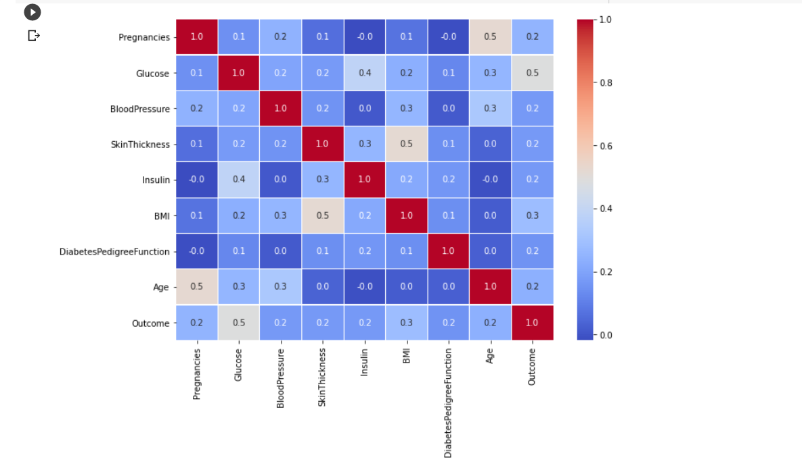
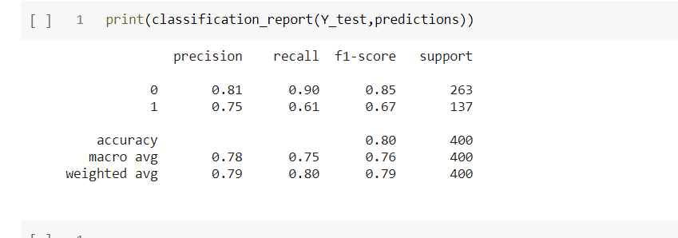

# Diabetes-Prediction-Project

## Project Overview :
In this project I have predicted the chances of diabetes using diabetes dataset.This dataset has been collected from Kaggle. This dataset contains the sign and symptpom data of newly diabetic or would be diabetic patient.

The datasets consists of several medical predictor variables and one target variable, class. Predictor variables includes the Age, gender, Polyuria,Polydipsia and so on.

## Installations :
This project requires Python 3.x and the following Python libraries should be installed to get the project started:
- Numpy
- Pandas
- matplotlib
- scikit-learn
- seaborn

### About Data
This dataset contains the sign and symptpom data of newly diabetic or would be diabetic patient.the all data is collectes as a numberic value .

#### Features of the dataset
The dataset consist of total **09** features and one target variable named class.

**1. Pregnancies:** Pregnancies value  ranging from (0 to 17) 
**2. Glucose:** Glucose Value ranging from (0 to 199) 
**3. BloodPressure:** BloodPressure Value ranging from (0 to 122) 
**4. SkinThickness:** Skin Thickness Value ranging from (0 to 110) 
**5. Insulin:** Insulin Value ranging from (0 to 744) 
**6. BMI:** BMI Value ranging from (0 to 80.6) 
**7. DiabetesPedigreeFunction:** DiabetesPedigreeFunction Value ranging from (0.08 to 2.42) 
**8. Age:** Age Value ranging from (21 to 81) 

**Outcome:** 0 / 1

## Steps to be Followed :
Following steps I have taken to apply machine learning models:

- Importing Essential Libraries.
- Data Preparation & Data Cleaning.
- Data Visualization
- Feature Selection and Data Standardization
- Model Evaluation

## Model Evaluation :
I have done model evaluation based on following sklearn metric.
- Loading Logistic Regression Model For Predictions
- Loading SVM Model For Predictions

## Results :
The result of Logistic Regression and SVM Model with or without feature selection is shown below.

