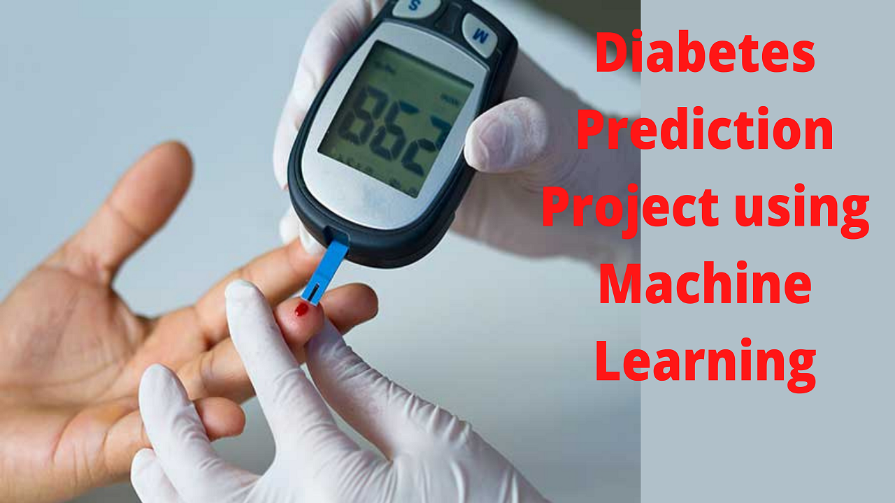

# Diabetes Prediction Project using Machine Learning

## Project Overview :
In this project I have predicted the chances of diabetes using diabetes dataset. This information was gathered via Kaggle. The sign and symptom data of newly diabetic or would-be diabetic patients are included in this dataset.

There are several medical predictor variables in the dataset, as well as one target variable, Outcome. Age, gender, glucose, BMI, and other predictor variables are examples of predictor variables.

## Installations :
This project requires Python 3.x and the following Python libraries should be installed to get the project started:
-[x] Numpy
-[x] Pandas
-[x] matplotlib
-[x] scikit-learn
-[x] seaborn

### About Data
This dataset provides data on newly diabetic or diabetic-in-waiting individuals' signs and symptoms. This information is gathered as a numerical value.

#### Features of the dataset
The dataset consist of total **08** features and one target variable named Outcome.

**1. Pregnancies:** Pregnancies value  ranging from (0 to 17) 
**2. Glucose:** Glucose Value ranging from (0 to 199) 
**3. BloodPressure:** BloodPressure Value ranging from (0 to 122) 
**4. SkinThickness:** Skin Thickness Value ranging from (0 to 110) 
**5. Insulin:** Insulin Value ranging from (0 to 744) 
**6. BMI:** BMI Value ranging from (0 to 80.6) 
**7. DiabetesPedigreeFunction:** DiabetesPedigreeFunction Value ranging from (0.08 to 2.42) 
**8. Age:** Age Value ranging from (21 to 81) 

**Outcome:** 0 / 1

## Steps to be Followed :
Following steps I have taken to apply machine learning models:

-[x] Importing Essential Libraries.
-[x] Data Preparation & Data Cleaning.
-[x] Data Visualization
-[x] Feature Selection and Data Standardization
-[x] Model Evaluation

## Model Evaluation :
I have done model evaluation based on following sklearn metric.
- Loading Logistic Regression Model For Predictions
- Loading SVM Model For Predictions

## Results :
The result of Logistic Regression and SVM Model with or without feature selection is shown below.

